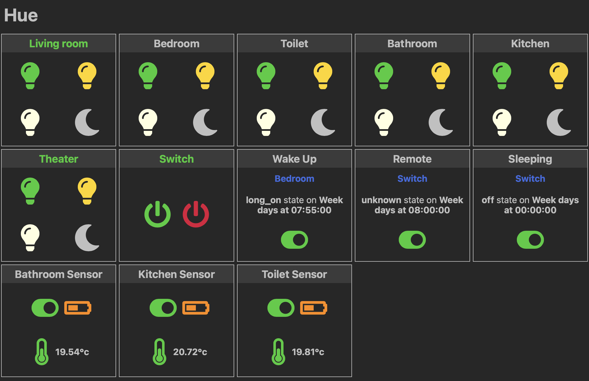

# hue

[](https://github.com/ViBiOh/hue/actions)
[](https://codecov.io/gh/ViBiOh/hue)
[](https://sonarcloud.io/dashboard?id=ViBiOh_hue)

A web interface for easily managing your Hue installation.



## Getting started

Golang binary is built with static link. You can download it directly from the [Github Release page](https://github.com/ViBiOh/hue/releases) or build it by yourself by cloning this repo and running `make`.

A Docker image is available for `amd64`, `arm` and `arm64` platforms on Docker Hub: [vibioh/hue](https://hub.docker.com/r/vibioh/hue/tags).

You can configure app by passing CLI args or environment variables (cf. [Usage](#usage) section). The args override environment variables.

It's a single static binary with embedded templates and static. No Javascript framework. HTTP and HTML have all we need. The recommended way to use it is the Docker container but binary is self-sufficient too.

You'll find a Kubernetes exemple in the [`infra/`](infra/) folder. It contains two ingresses : one for "same network access" and another, publicly available but with basic-auth.

### Get credentials from bridge

To connect to your bridge, you'll need credentials generated by Hue Bridge.

Get username for Hue API by browsing `http://192.168.1.10/debug/clip.html` and retrieve username credentials.

```
POST /api
Body: {"devicetype":"hue"}
```

### Using it

It's recommended to use the official Hue mobile app for setupping and configuring your devices. The goal of this project is to provide an easy-to-use web interface for controlling the lights.

When turning lights on, there are 3 availables states:

- `on`: 100% brightness in 5 seconds, to avoid eyes bleeding
- `half`: 50% brightness in 5 seconds, for some ambiance lighting
- `dimmed`: minimum brightness in 5 seconds, for very low light need

You can use this software to configure a subset of your Hue installation:

- Hue Tap buttons behaviors
- Hue Motion Sensor behaviors
- Schedule light on/off based on time

It also support some third-party devices that are compatible with the Hub, such a power-switch. In this case there is only two mode : on/off.

### Why ?

Most IoT devices and platforms are relying on applications installed on your smartphone. But if you're not alone at home, you have to share your credentials with others, which is a wrong security pattern.

This interface allows anybody who have access to manage lights. In a local network, with a properly configured firewall, anyone on the WiFi can turn off/on lights, from mobile-ready dark mode web interface.

The application is not a app or hub replacement, it uses the Hub's API and is not required to continue to use your existing remotes ou app like you already do.

### Metrics

The web service exposes two specifics metrics gathered from the motions sensors: the battery life and the temperature. They are available on the prometheus endpoint `/metrics` (cf. [Usage](#usage) section). It also exposes basic Golang and HTTP metrics.

## Usage

The application can be configured by passing CLI args described below or their equivalent as environment variable. CLI values take precedence over environments variables.

Be careful when using the CLI values, if someone list the processes on the system, they will appear in plain-text. Pass secrets by environment variables: it's less easily visible.

```bash
Usage of hue:
  -address string
        [server] Listen address {HUE_ADDRESS}
  -bridgeIP string
        [hue] IP of Bridge {HUE_BRIDGE_IP}
  -cert string
        [server] Certificate file {HUE_CERT}
  -config string
        [hue] Configuration filename {HUE_CONFIG}
  -corsCredentials
        [cors] Access-Control-Allow-Credentials {HUE_CORS_CREDENTIALS}
  -corsExpose string
        [cors] Access-Control-Expose-Headers {HUE_CORS_EXPOSE}
  -corsHeaders string
        [cors] Access-Control-Allow-Headers {HUE_CORS_HEADERS} (default "Content-Type")
  -corsMethods string
        [cors] Access-Control-Allow-Methods {HUE_CORS_METHODS} (default "GET")
  -corsOrigin string
        [cors] Access-Control-Allow-Origin {HUE_CORS_ORIGIN} (default "*")
  -csp string
        [owasp] Content-Security-Policy {HUE_CSP} (default "default-src 'self'; script-src 'httputils-nonce'; style-src 'httputils-nonce'")
  -frameOptions string
        [owasp] X-Frame-Options {HUE_FRAME_OPTIONS} (default "deny")
  -graceDuration string
        [http] Grace duration when SIGTERM received {HUE_GRACE_DURATION} (default "30s")
  -hsts
        [owasp] Indicate Strict Transport Security {HUE_HSTS} (default true)
  -idleTimeout string
        [server] Idle Timeout {HUE_IDLE_TIMEOUT} (default "2m")
  -key string
        [server] Key file {HUE_KEY}
  -loggerJson
        [logger] Log format as JSON {HUE_LOGGER_JSON}
  -loggerLevel string
        [logger] Logger level {HUE_LOGGER_LEVEL} (default "INFO")
  -loggerLevelKey string
        [logger] Key for level in JSON {HUE_LOGGER_LEVEL_KEY} (default "level")
  -loggerMessageKey string
        [logger] Key for message in JSON {HUE_LOGGER_MESSAGE_KEY} (default "message")
  -loggerTimeKey string
        [logger] Key for timestamp in JSON {HUE_LOGGER_TIME_KEY} (default "time")
  -minify
        Minify HTML {HUE_MINIFY} (default true)
  -okStatus int
        [http] Healthy HTTP Status code {HUE_OK_STATUS} (default 204)
  -pathPrefix string
        Root Path Prefix {HUE_PATH_PREFIX}
  -port uint
        [server] Listen port (0 to disable) {HUE_PORT} (default 1080)
  -prometheusAddress string
        [prometheus] Listen address {HUE_PROMETHEUS_ADDRESS}
  -prometheusCert string
        [prometheus] Certificate file {HUE_PROMETHEUS_CERT}
  -prometheusGzip
        [prometheus] Enable gzip compression of metrics output {HUE_PROMETHEUS_GZIP}
  -prometheusIdleTimeout string
        [prometheus] Idle Timeout {HUE_PROMETHEUS_IDLE_TIMEOUT} (default "10s")
  -prometheusIgnore string
        [prometheus] Ignored path prefixes for metrics, comma separated {HUE_PROMETHEUS_IGNORE}
  -prometheusKey string
        [prometheus] Key file {HUE_PROMETHEUS_KEY}
  -prometheusPort uint
        [prometheus] Listen port (0 to disable) {HUE_PROMETHEUS_PORT} (default 9090)
  -prometheusReadTimeout string
        [prometheus] Read Timeout {HUE_PROMETHEUS_READ_TIMEOUT} (default "5s")
  -prometheusShutdownTimeout string
        [prometheus] Shutdown Timeout {HUE_PROMETHEUS_SHUTDOWN_TIMEOUT} (default "5s")
  -prometheusWriteTimeout string
        [prometheus] Write Timeout {HUE_PROMETHEUS_WRITE_TIMEOUT} (default "10s")
  -publicURL string
        Public URL {HUE_PUBLIC_URL} (default "https://hue.vibioh.fr")
  -readTimeout string
        [server] Read Timeout {HUE_READ_TIMEOUT} (default "5s")
  -shutdownTimeout string
        [server] Shutdown Timeout {HUE_SHUTDOWN_TIMEOUT} (default "10s")
  -title string
        Application title {HUE_TITLE} (default "Hue")
  -url string
        [alcotest] URL to check {HUE_URL}
  -userAgent string
        [alcotest] User-Agent for check {HUE_USER_AGENT} (default "Alcotest")
  -username string
        [hue] Username for Bridge {HUE_USERNAME}
  -writeTimeout string
        [server] Write Timeout {HUE_WRITE_TIMEOUT} (default "10s")
```
